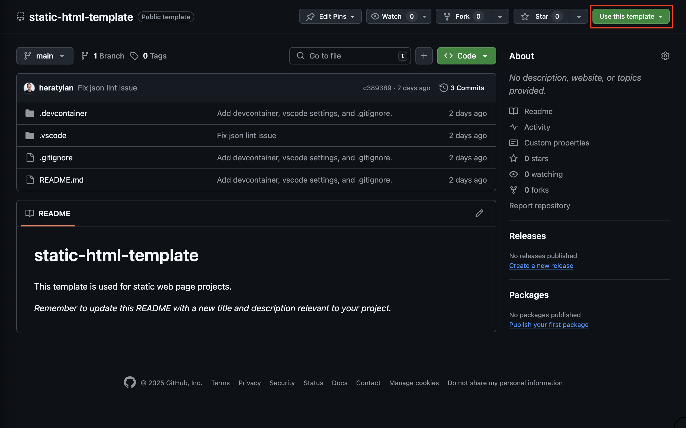
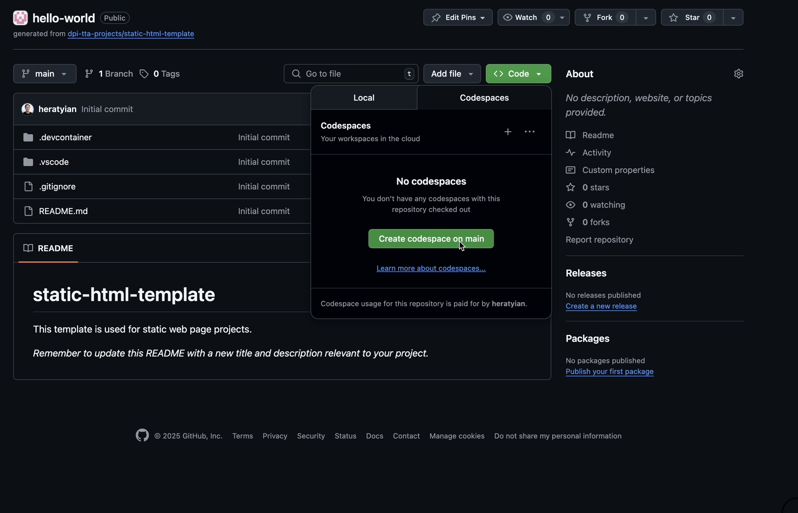
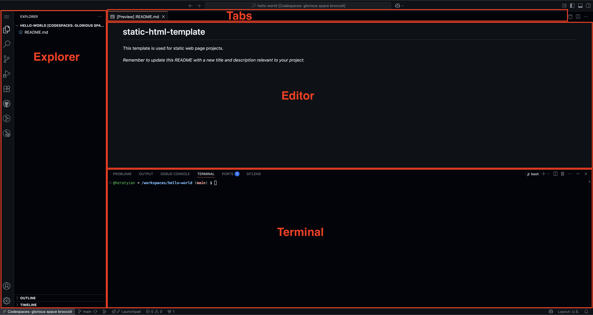
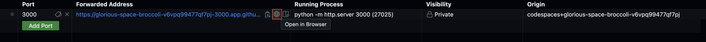
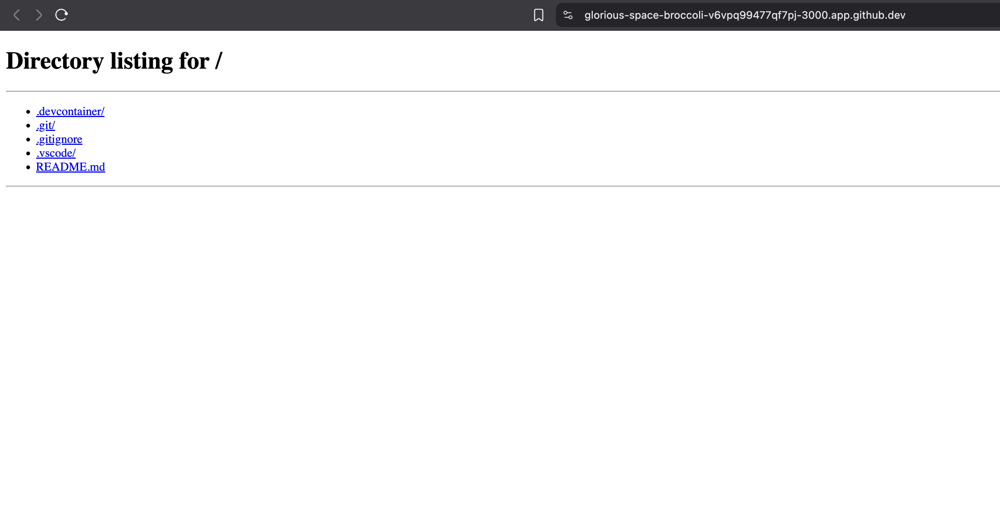
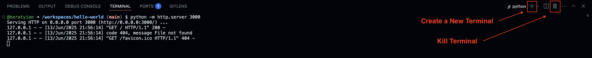
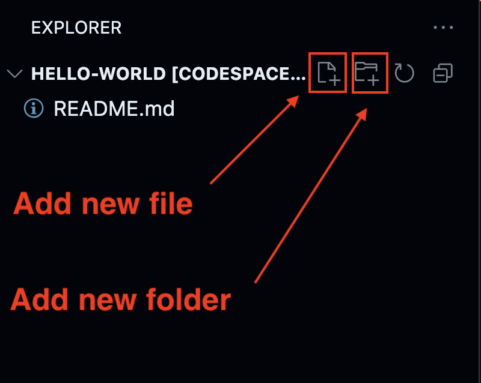
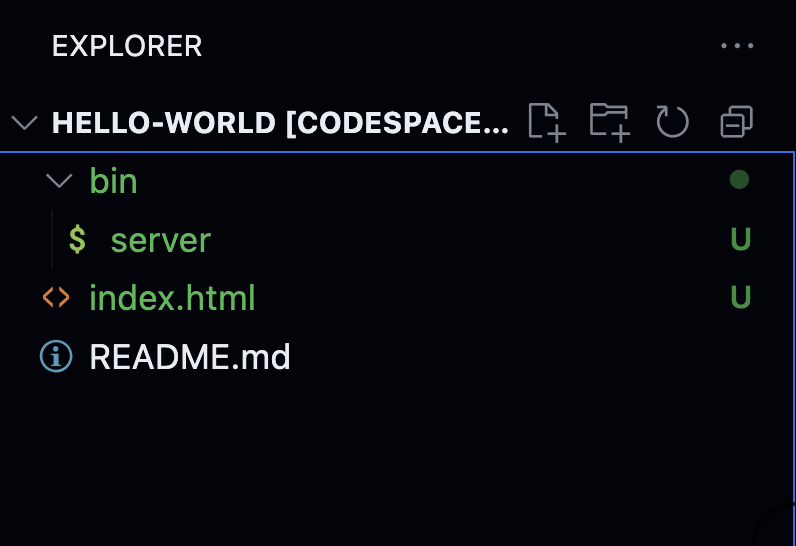
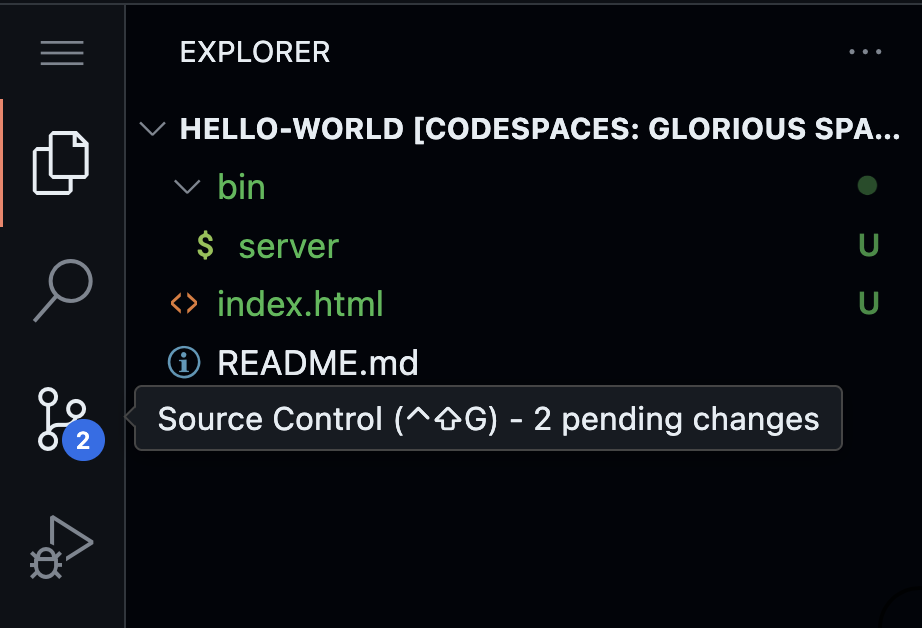
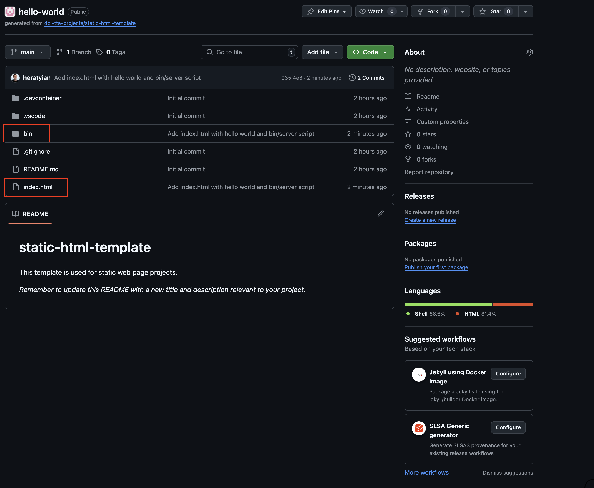

# Getting Started with GitHub Codespaces

Start coding in the cloud with GitHub’s powerful, browser-based editor.

## Goal

By the end of this lesson, you’ll have a live static website running in a GitHub Codespace, all from your browser.

<video src="assets/goal-completed.mp4" autoplay loop muted playsinline></video>

## Set Up GitHub

First, you'll need a GitHub account.

- Go to <a href="https://github.com" target="_blank">https://github.com</a>
- Click "Sign up" and follow the prompts

Already have an account? You're good to go!

## 1. Create a Repository

**Goal**: Set up a new project on GitHub using a ready-made template.

<video src="assets/create-repo-from-template.mp4" autoplay loop muted playsinline></video>

A repository (or "repo") is where your project lives.

We’ve made a starter project template for you: 👉 <a href="https://github.com/dpi-tta-projects/static-html-template" target="_blank">static-html-template</a>

Click "Use this template" to begin.



Then:

- Name your repo (e.g., `my-first-app`)
- Set visibility: **Public** or **Private**

<aside class="warning">You'll need to make your repository "public" in order for others to access your repository.</aside>

- Click Create repository

<aside class="tip">
  <strong>Naming convention:</strong> Use lowercase letters and dashes (e.g., <code>my-first-app</code>). This style is called <strong>kebab-case</strong> and is commonly used in web development.
</aside>

## 2. Launch a Codespace

**Goal**: Open your GitHub project in a cloud-based development environment — no setup required.



Go to your new repo and:

- Click the green "Code" button
- Select the "Codespaces" tab
- Click "Create codespace on main"

Your browser will open a full development environment, no installs required!

<aside class="warning">
  Be patient. The first time you load a codespace may take a few minutes. Subsequent loads will be much faster.
</aside>

## 3. Explore the Codespace

**Goal**: Learn your way around the Codespace layout so you know where to find and write your code.



Here’s a quick tour of the layout:

- **Explorer** (left panel): your files
- **Editor** (center panel): where you write code
- **Terminal** (bottom panel): run commands
- **Tabs** (top): open files

<aside class="tip">
  Shortcut to toggle <strong>Terminal</strong>:
  <ul>
    <li>
      <code>Ctrl + J</code> (Windows/Linux)
    </li>
    <li>
      <code>⌘ + J</code> (Mac)
    </li>
  </ul>
  <video src="assets/shortcut-toggle-terminal.mp4" autoplay loop muted playsinline></video>
</aside>

<aside class="tip">
  Shortcut to toggle <strong>Explorer</strong>:
  <ul>
    <li>
      <code>Ctrl + B</code> (Windows/Linux)
    </li>
    <li>
      <code>⌘ + B</code> (Mac)
    </li>
  </ul>
  <video src="assets/shortcut-toggle-explorer.mp4" autoplay loop muted playsinline></video>
</aside>

## 4. Start a Local Server

**Goal**: Run a local development server to view your project in the browser.

<video src="assets/starting-http-server-and-port.mp4" autoplay loop muted playsinline></video>

In the terminal, type:

```bash
python -m http.server 3000
```
{: .copyable }

<aside class="tip">
  This command starts a lightweight web server on port 3000 — ideal for serving static files like HTML and CSS.
</aside>

<aside>
  <a href="https://docs.python.org/3/library/http.server.html" target="_blank">📘 Docs: http.server</a>
</aside>

GitHub will show a URL (a "forwarded port") to preview your site. Click the ports tab in the bottom panel. Click on the 🌐 icon to open your app in a browser tab.



<aside class="tip">
  If you'd like to access your app from any device, set the port visibility to <strong>public</strong>. This way you can access your app from your phone and share the link with friends.
</aside>

<aside class="tip">



When you visit your Codespace preview and see <code>Directory listing for /</code>, it means your web server is running, but there’s no <code>index.html</code> file present.

Web servers look for a default file to show — usually <code>index.html</code>. If it’s missing, the server shows a list of files and folders in your project instead. This is called a "directory listing".

Once you add <code>index.html</code>, that file will be shown automatically instead of the listing.

</aside>

<aside class="tip">
  Stop your server by entering <code>Ctrl + C</code> in the terminal. This works with most terminal processes. If all else fails, you can also close the terminal running the process.
</aside>

<aside class="tip">
  

  In the terminal tab, click `+` to create additional terminal instances. You can also click the trash icon to destroy the terminal instance.
</aside>

## 5. Add an index.html Page

**Goal**: Create your first web page and see it live in the browser.

<video src="assets/create-index-html.mp4" autoplay loop muted playsinline></video>

Create a new file named `index.html` and add:

```html
<h1>Hello, world!</h1>
```
{: .copyable }

Refresh the preview to see it live.

<aside>
  Why <code>index.html</code>? It’s the default page that web servers serve when you visit a folder path like `/`. Think of it like a "table of contents" for your website.
</aside>

<aside class="tip">
  Use the vs code explorer 'new file' and 'new folder' buttons.

  
</aside>

<aside>
  🛠️ Try It: Edit your h1 to say your name, like: <code>Hello from Ian!</code>. Then refresh your preview tab to see your personalized message.
</aside>

## 6. Create a `bin/server` Script

**Goal**: Automate server startup with a simple script so you can launch your app with one command.

<video src="assets/create-bin-server.mp4" autoplay loop muted playsinline></video>

Let’s automate our server start-up.

Make a folder called `bin`. Inside `bin`, create a file called `server`.

Paste this code:

```bash
#!/usr/bin/env bash

python -m http.server 3000
```
{: .copyable }

In terminal, run:

```bash
chmod +x bin/server
```
{: .copyable }

<aside class="tip">
  The <code>chmod +x</code> command makes your script executable, meaning you can run it like a regular program.
</aside>

Now you can start your server using this script by typing `bin/server` in the terminal and hitting enter.

```bash
bin/server
```
{: .copyable }

<aside class="tip">
  The <code>bin</code> folder is a convention for small executable scripts. The <code>#!/usr/bin/env</code> line (a "shebang") tells the system which interpreter to use for the script. (in our case, <code>bash</code>, the same shell we use in the terminal)
</aside>

## 7. Save Your Work with Git

**Goal**: Save your project changes and push them to GitHub so your work is safely backed up online.

<aside class="warning">
  Codespaces are temporary environments. Saving your code is not enough, you must commit and push to GitHub to avoid losing your work.
</aside>

You'll notice your new files will appear in <span class="text-success">green</span> color.



The source control tab in the left pane will also indicate that you have '2 pending changes'.



There are two ways to save your work to GitHub:

- (a) Use the VS Code Source Control Tab (beginner-friendly)
- (b) Use Git commands in the terminal (if you're comfortable with the command line)

Both methods achieve the same result.

### 7.1 (a) In the VS Code Source Control Tab

<video src="assets/source-control-tab-commit-push-sync.mp4" autoplay loop muted playsinline></video>

Click the Source Control icon (looks like a branch).


- Stage the files you want to commit (click the '+' next to each file)
- Write a commit message "Add index.html with hello world and bin/server script"
- Click '✓ Commit' to commit
- Click 'Sync Changes' to push to GitHub

<aside>
  Committing your code saves a snapshot. Pushing it sends that snapshot to GitHub where it can be safely stored long term.
</aside>

Your code is now saved online!

### 7.1 (b) In the terminal

Use `git status` to see the status of your changes:

```bash
git status
```
{: .copyable }

You'll see an output like this:

```bash
On branch main
Your branch is up to date with 'origin/main'.

Untracked files:
  (use "git add <file>..." to include in what will be committed)
        bin/
        index.html

nothing added to commit but untracked files present (use "git add" to track)
```

Let's 'stage' the files we just created so we can commit and push to GitHub.

<aside class="tip">
  You will only "commit" files that have been staged first.
</aside>

```bash
git add index.html
git add bin/server
```
{: .copyable }

<aside class="tip">
  Use the tab key to autocomplete file and folder names in the terminal. ⏱️ This is a HUGE time saver.
</aside>

Let's see the status of our changes now using `git status`. You should see an output like this:

```bash
On branch main
Your branch is up to date with 'origin/main'.

Changes to be committed:
  (use "git restore --staged <file>..." to unstage)
        new file:   bin/server
        new file:   index.html
```

We've now "staged" our files. Let's commit our changes and push to GitHub.

```bash
git commit -m "Add index.html with hello world and bin/server script"
```
{: .copyable }

You'll see an output like this confirming the commit. This means we've committed locally.

```bash
[main 935f4e3] Add index.html with hello world and bin/server script
 2 files changed, 4 insertions(+)
 create mode 100755 bin/server
 create mode 100644 index.html
```

<aside class="tip">
  Enter <code>git log</code> in the terminal to see your commit history.
</aside>

Now we're ready to push to our commits to GitHub. Enter this Git command in the terminal:

```bash
git push
```

If successful you'll see an output like this:

```bash
Enumerating objects: 6, done.
Counting objects: 100% (6/6), done.
Delta compression using up to 2 threads
Compressing objects: 100% (2/2), done.
Writing objects: 100% (5/5), 458 bytes | 458.00 KiB/s, done.
Total 5 (delta 1), reused 0 (delta 0), pack-reused 0 (from 0)
remote: Resolving deltas: 100% (1/1), completed with 1 local object.
To https://github.com/heratyian-tta/hello-world
   5cf5cfb..935f4e3  main -> main
```

Your code is now safely saved online!

<aside class="tip">
  Once a file has been committed and is being tracked by Git, use <code>git diff</code> to compare your changes with the previous commit.

  <pre>
    <code>
      diff --git a/index.html b/index.html
      index 6b5d288..ee9e459 100644
      --- a/index.html
      +++ b/index.html
      @@ -1 +1 @@
      -<h1>Hello, world!</h1>
      \ No newline at end of file
      +<h1>Hello, world!!!</h1>
      \ No newline at end of file
    </code>
  </pre>
</aside>

### 7.2 Confirm In GitHub

Go to your repo in GitHub to verify your files have been properly staged, committed, and pushed. You should now see the `index.html` and `bin/server` files in GitHub.

<aside class="tip">
  Enter <code>git remote -v</code> in the terminal to get a link to your repository in GitHub.
</aside>



<aside class="tip">
  <strong>Write commit messages like you're telling a teammate what changed.</strong> Use the present tense (e.g., "Add homepage" or "Fix broken link") and keep it short but clear. Aim for what changed and why — not just "update" or "stuff" or "changes".
</aside>

<aside class="warning">
  If you forget to add a commit message (like just typing <code>git commit</code> without `-m`), Git will open a special screen called <code>COMMIT_EDITMSG</code>. This can be confusing.

  All commits must have a message. So, if you see this pop up, just type your message, save, and close the tab.

  <!-- `Ctrl + X`, then `Y`, then `Enter` if you're in nano. -->
  <video src="assets/commit_edtmsg_gui.mp4" autoplay loop muted playsinline></video>
</aside>

<aside class="danger">
  Each GitHub user gets limited free hours for Codespaces. To manage or delete your environments:

  <ol>
    <li>Go to <a href="https://github.com/codespaces" target="_blank">https://github.com/codespaces</a></li>
    <li>Click the "..." next to a Codespace to stop or delete it</li>
  </ol>

  Deleting unused Codespaces frees up your quota and prevents unnecessary charges.
</aside>

## Recap

You just:

- ✅ Created a GitHub repo from a template
- ✅ Launched a Codespace
- ✅ Ran a live web server
- ✅ Wrote an HTML page
- ✅ Pushed your code to GitHub

You now have a live web development environment in the cloud!

## Practice Challenge

- Add an `<h2>` subtitle
- Include a `<p>` paragraph with a message
- Use the terminal to commit and push your changes
- Create additional HTML files (like `about.html`) and open them at `/about.html` in your browser.
- Bonus: Link to your new pages using `<a>` links
